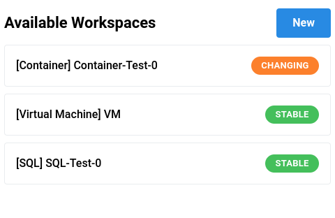
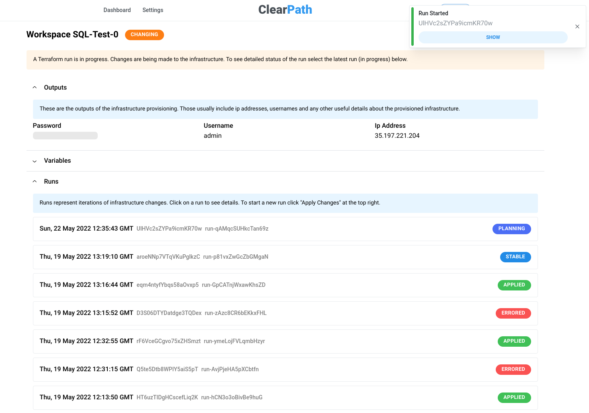
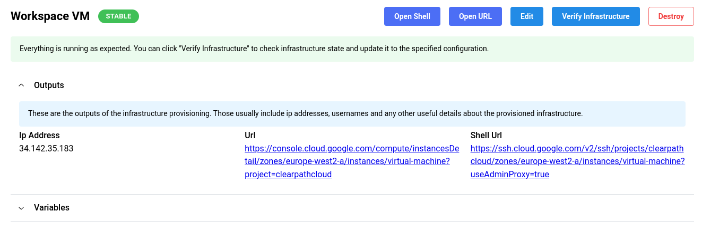
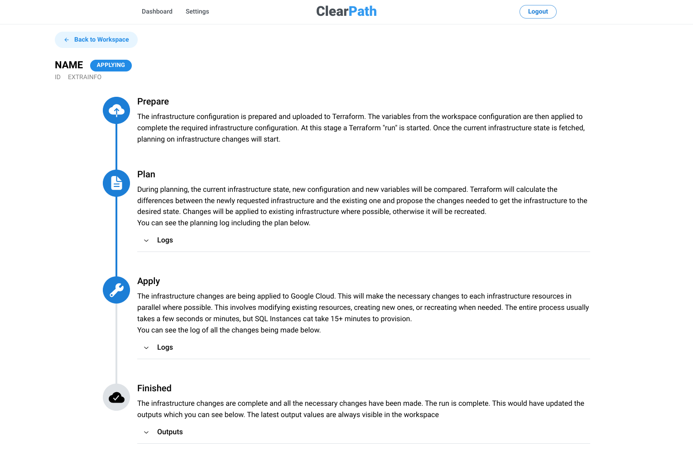

# 🌩️ ClearPath (Surrey CompSci 2022 FYP)

A prototype streamlined infrastructure management platform on top of public cloud to improve DX.

## Tech
- Next.js
- Google Cloud Platform
- Terraform Cloud
- Firebase Auth & Firestore

## Purpose
Offer a "heroku-like" experience for managing infrastructure with full flexibility and pricing of public cloud (GCP for the prototype).

Works on top of the user's stack (GCP, Terraform Cloud) leaving them in full control of their infrastructure.

Inspired by [Backstage](https://backstage.io/) and [Heroku](https://heroku.com/).
## Use
While this is a functional prototype with reasonable attention to reliability and security, it is likely not production ready. 

If you are looking for something similar, many new services like [Railway](https://railway.com), [Fly.io](https://fly.io/) and [Flightcontrol](https://www.flightcontrol.dev/) are now available and offer similar and likely better experience.

## Screenshots
### Workspaces

### Workspace Overview

### Workspace with direct actions

### Run details

## 👩‍💻 Getting Started with development

Have an up to date version of Node.js 14+ installed, ideally with `yarn` installed as well

Clone the repository

Optionally open VSCode in this directory

Don't forget to install dependencies with `yarn` or `yarn install`

You can now run the next dev server with `yarn dev`.

### Commands
There are some useful commands (found inside `package.json`) that you can run to help you with development.

#### `yarn dev`
Starts a development server. There is hot-reloading (changes apply without refresh) so you can easily view and test the app during dev. 

#### `yarn build`
Creates a production-ready, optimized build of the website. Once the app is built, you can use `yarn start` (see below) to use it.

#### `yarn start`
Starts the production server. Please make sure to run `yarn build` first to build the latest version of the app before starting the prod server.

#### `yarn lint`
Runs the linter (ESLint) on all of the website code. This will check for any warnings or critical lint suggestions.

## 🏗️ Structure
[Standard Next.js layout](https://nextjs.org/docs/getting-started)

`/pages` for all website

`/pages/api` for api routes specifically

`/lib` for any helpers or libraries

`/lib/workflows.tsx` contains the main workflows the application runs

`/components` for any JSX / React components
